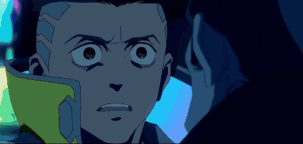
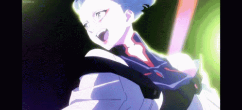

<!-- ░▒▓ nskge // ocre ▓▒░  — red team in progress -->

<div align="center">


<a href="https://git.io/typing-svg">
  
</a>

<h3>ocre &nbsp;<code>//</code>&nbsp; <code>nskge</code></h3>

<p>
<b>Cybersec enthusiast</b> · Full-Stack learner · transição pra <b>Segurança Ofensiva</b><br>
<sub>Santos, SP — BR · <code>RED TEAM MBA :: 0/2</code> · <code>ADS :: 5/5</code></sub>
</p>

<p>
  
  
  
</p>

</div>


## `$ whoami`

```bash
ocre@nightcity:~$ cat /etc/profile

  ┌─[ IDENTITY ]──────────────────────────────────────────────┐
  │  name      :: Sândalo Ocre  (aka ocre / nskge)             │
  │  role      :: IT Support Intern @ APL Logistics            │
  │  studying  :: Análise e Desenvolvimento de Sistemas        │
  │               UNISANTA — 5/5 (conclusão 2026)              │
  │  focus     :: Offensive Security // Red Team               │
  │  also      :: Cloud (Azure) · Networking · Full-Stack      │
  │  langs     :: pt-BR · en · es  (suporte multilíngue diário)│
  │  status    :: hacking, learning, breaking, repeating       │
  └────────────────────────────────────────────────────────────┘

ocre@nightcity:~$ sudo make me a red teamer
[####################------------]  62%  ...still cooking 🔥
```


## `> ./arsenal --offensive`

<p>
  
  
  
  
  
  
  
</p>

## `> ./arsenal --dev`

<p>
  
  
  
  
  
  
  
  
  
</p>

## `> ./arsenal --cloud-infra`

<p>
  
  
  
  
  
  
  
  
</p>


## `> cat ./projects/OkrScann.md`

<table>
<tr>
<td width="62%" valign="top">

### 💀 OkrScann — Web Vulnerability Scanner

Scanner modular de vulnerabilidades web, escrito do zero em **Python**.
Automação de pentest web de ponta a ponta:

- 🩸 **Módulos de ataque:** SQLi · XSS · LFI · SSRF · XXE · JWT · GraphQL · 403 Bypass
- 🎯 **Detecção de 34 CVEs** em múltiplas tecnologias
- 🕷️ **Recon:** crawling com Playwright, enum de subdomínios, descoberta de paths e port scanning
- 📄 Geração automática de relatórios

> _"Breaking things to understand them."_

</td>
<td width="38%" valign="top" align="center">



</td>
</tr>
</table>


## `> ./stats --dump`

<div align="center">


</div>


<div align="center">




## `> ./connect --encrypted`

<a href="https://linkedin.com/in/sandaloocre/" target="_blank">
  
</a>
<a href="mailto:ocresandalo@gmail.com">
  
</a>
<a href="https://github.com/nskge">
  
</a>

<br><br>


<sub><code>// wake the f*ck up, samurai. we have vulns to find. //</code></sub>

</div>


