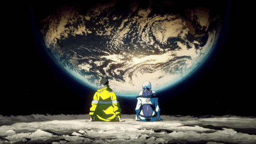
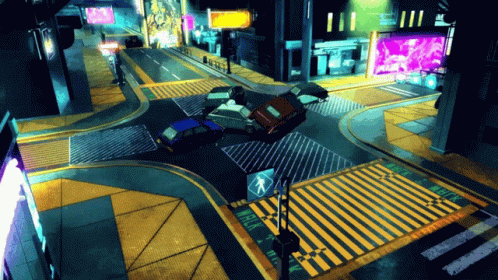

<!-- ░▒▓ nskge // ocre ▓▒░  — offensive security in progress -->

<div align="center">




<a href="https://git.io/typing-svg">
  
</a>

<h3>ocre &nbsp;<code>//</code>&nbsp; <code>nskge</code></h3>

<p>
Studying <b>Pentest Web & Red Team</b> · Offensive Security<br>
<sub><code>FIAP :: Red Team & Pentest postgrad (incoming)</code> · <code>ADS :: final year</code></sub>
</p>

<p>
  
  
  
</p>

</div>


## `$ whoami`

```bash
ocre@nightcity:~$ cat /etc/profile

  ┌─[ IDENTITY ]──────────────────────────────────────────────┐
  │  name      :: Sândalo (San) Ocre · aka ocre / nskge         │
  │  studying  :: Systems Analysis & Development — final year    │
  │  next      :: Red Team & Pentest postgrad @ FIAP            │
  │  focus     :: Pentest Web · Red Team · Offensive Security    │
  │  worked    :: IT support · infra · software dev · automation │
  │  langs     :: pt · en · es                                  │
  │  status    :: studying hard, breaking things to learn them  │
  └────────────────────────────────────────────────────────────┘

ocre@nightcity:~$ sudo make me a red teamer
[##############------------------]  in progress  ...just grinding 🟣
```


## `> ./arsenal --offensive`

<p>
  
  
  
  
  
  
  
  
</p>

## `> ./arsenal --dev`

<p>
  
</p>

## `> ./arsenal --cloud-infra`

<p>
  
</p>
<p>
  
  
  
  
</p>


## `> ls ./projects`

<p>
  <a href="https://github.com/nskge/abaddon">
    
  </a>
  &nbsp;
  <a href="https://github.com/nskge/CaptureTheOkr">
    
  </a>
</p>

<sub>Pinned repos below — that's where the real stuff lives. 👇</sub>


## `> ./stats --dump`

<div align="center">


</div>


<div align="center">



## `> ./connect --encrypted`

<a href="https://linkedin.com/in/sandaloocre/" target="_blank">
  
</a>
<a href="mailto:ocresandalo@gmail.com">
  
</a>
<a href="https://github.com/nskge">
  
</a>

<br><br>


<sub><code>// wake the f*ck up, samurai. //</code></sub>

</div>


